# Top 18 AI Grammar Checkers for Academic Writing Ranked in 2025 (Latest Compilation)

Academic writing demands precision. One misplaced comma, one awkward sentence structure, and your research paper loses credibility. Whether you're a PhD student polishing your dissertation or a researcher preparing manuscripts for publication, finding the right grammar checker can make the difference between acceptance and rejection.

These tools catch technical terminology mistakes, ensure proper citation formats, maintain formal tone, and polish complex sentence structures that general writing tools often miss. From free options for students on tight budgets to premium platforms with plagiarism detection and style guide enforcement, this guide covers the best academic writing assistants available right now.

---

## **[Trinka AI](https://www.trinka.ai)**

AI-powered academic writing specialist trained on millions of scholarly papers across 1,300+ subject areas.

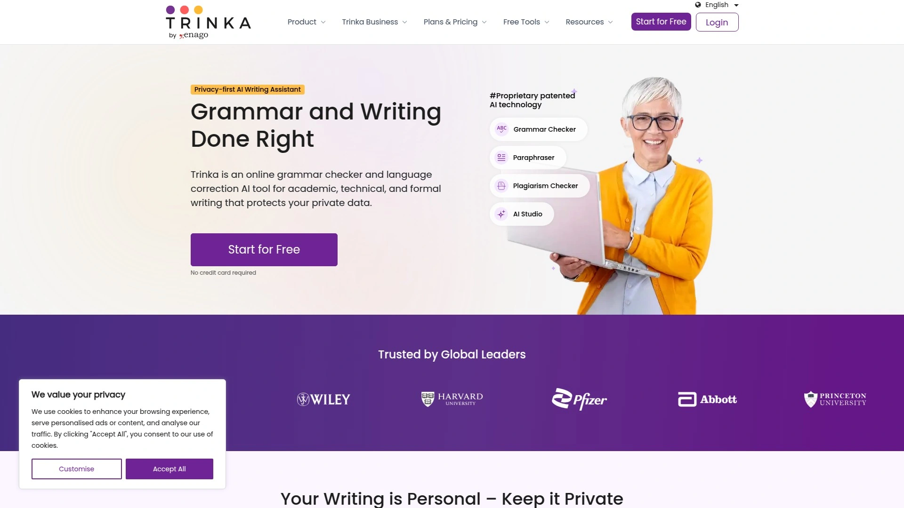

Trinka distinguishes itself by understanding the nuances of academic discourse. The platform corrects over 3,000 complex grammar errors that standard checkers overlook, including subject-specific terminology in medicine, engineering, physics, and social sciences. Its contextual grammar correction adapts to your research field, recognizing technical jargon and specialized phrasing patterns.

The tool excels at enforcing academic tone and style conventions. It automatically converts informal language into scholarly expressions, restructures wordy phrases to meet journal word limits, and eliminates biased language that could weaken your arguments. Trinka's consistency checker ensures uniform hyphenation, spelling variants, and formatting throughout lengthy documents.

For researchers, the citation checker identifies weak or outdated references, while the journal finder matches your manuscript to suitable publications based on content analysis. The file upload feature processes entire Word documents while preserving formatting, applying tracked changes for easy review. Free users get 5,000 words monthly with basic grammar checks, while premium subscribers access plagiarism detection, advanced style analysis, and unlimited processing.

Integration options include browser extensions, Word add-ins, and LaTeX support for technical papers. The platform prioritizes data security with encryption and automatic deletion of premium user data after 90 days. Students appreciate the generous free tier, while research teams benefit from customizable style guides and collaborative editing features.

---

## **[Grammarly](https://www.grammarly.com)**

The market leader with 30+ million daily users and comprehensive writing assistance.

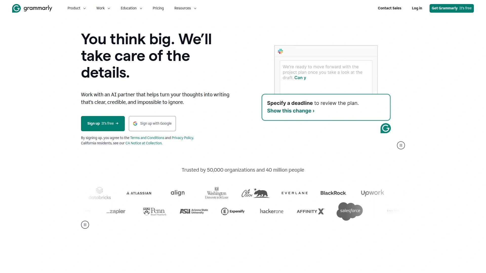

Grammarly combines breadth with accessibility. Its AI analyzes text against thousands of grammar rules while offering clarity improvements, vocabulary enhancements, and tone adjustments. The platform catches everything from basic spelling errors to sophisticated style issues, making it suitable for academic essays, research proposals, and professional correspondence.

The tone detector represents a standout feature—it evaluates your writing's emotional impact and suggests adjustments to match your intended audience. For academics, this helps maintain appropriate formality while ensuring arguments come across as confident rather than uncertain or aggressive. The plagiarism checker scans against 16 billion web pages, essential for maintaining academic integrity.

Real-time corrections appear as you type across browsers, email clients, and document editors through extensions and add-ins. The web editor provides detailed explanations for each suggestion, helping writers understand grammar rules rather than just fixing errors. Premium subscribers access advanced features like full-sentence rewrites, vocabulary suggestions, and genre-specific writing style checks.

The free version covers essential grammar, spelling, and punctuation, making it viable for students. Premium plans cost $12 monthly when billed annually, while business plans at $15 per member add team management features. Mobile apps ensure error-free writing on smartphones and tablets.

---

## **[QuillBot](https://quillbot.com)**

Versatile writing platform combining grammar checking with powerful paraphrasing capabilities.

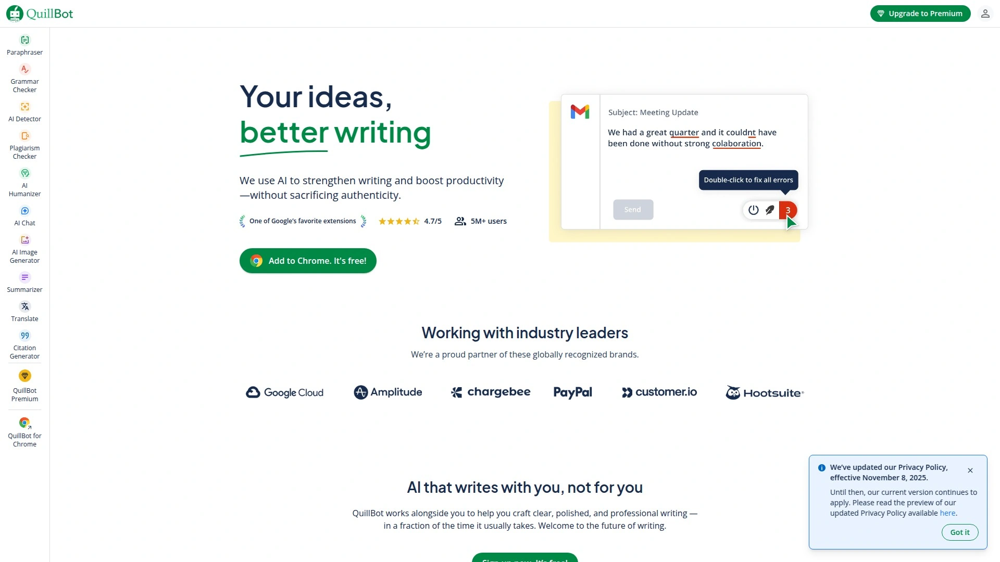

QuillBot appeals to writers who need more than error correction. The grammar checker identifies and fixes mistakes while the paraphrasing tool offers multiple rewrite options, useful when explaining complex concepts in different ways or avoiding repetitive phrasing in research papers. The summarizer condenses lengthy articles, helpful for literature reviews.

The citation generator supports major academic styles including APA, MLA, and Chicago, automatically formatting references from URLs, titles, or DOIs. The translator handles multiple languages, beneficial for non-native English speakers or researchers working with international sources. All tools integrate seamlessly, allowing writers to move between tasks without switching platforms.

QuillBot's free plan provides generous access to core features, though with usage limits. The grammar checker works on unlimited text, while paraphrasing restricts to 125 words per attempt and three writing modes. Premium subscribers at $9.95 monthly get unlimited paraphrasing, faster processing, and advanced writing modes for different contexts.

Browser extensions work across Google Docs, Gmail, and social media platforms. The interface remains clean and intuitive, avoiding the feature bloat that makes competing tools overwhelming. For students and researchers who write frequently, QuillBot offers exceptional value through its all-in-one approach.

---

## **[Paperpal](https://paperpal.com)**

Academic-focused AI writing assistant developed by publishing industry experts at Cactus Communications.

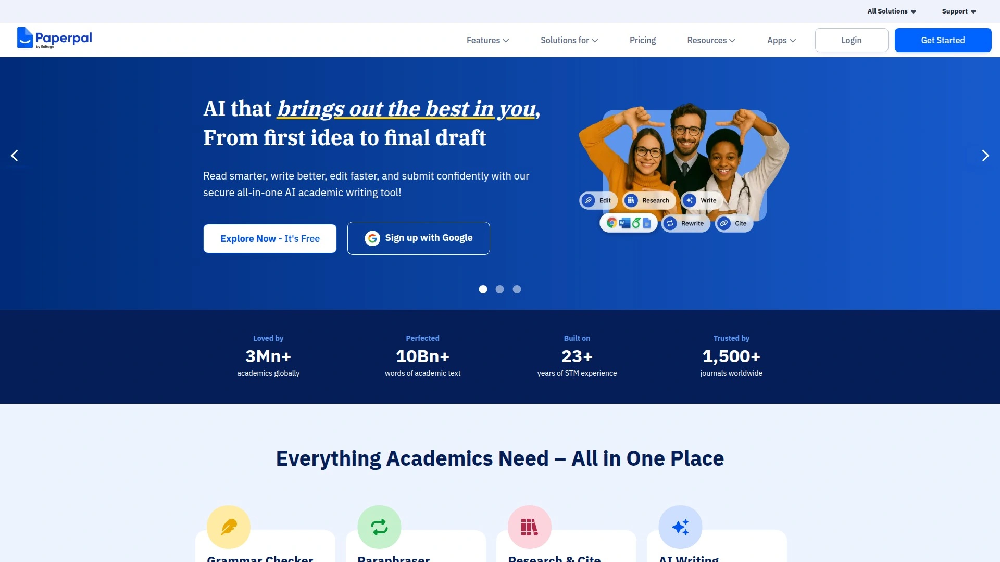

Paperpal tailors its suggestions specifically for scholarly writing conventions. Unlike general grammar checkers, it understands academic sentence structures and suggests improvements aligned with publication standards. The AI adapts to scientific contexts, offering specialized corrections for domain-specific terminology, acronyms, and technical jargon.

The platform excels at transforming unclear sentence structures into precise academic prose. Its consistency checks ensure uniform terminology, formatting, and style throughout manuscripts. The word count reducer helps meet strict journal length requirements without sacrificing content quality, while the tone checker maintains appropriate scholarly formality.

Researchers appreciate the contextual adaptability—Paperpal recognizes whether you're writing for medical journals, engineering conferences, or social science publications, adjusting recommendations accordingly. The grammar checker catches errors other tools miss, particularly in complex technical sentences common in research papers.

Integration with Google Docs and Microsoft Word enables real-time editing within familiar environments. Free users access grammar checking, spell checking, and basic writing assistance. Premium features include advanced paraphrasing, plagiarism detection, and unlimited document processing. The platform prioritizes security, processing data without external access or storage.

---

## **[ProWritingAid](https://prowritingaid.com)**

Comprehensive writing platform offering 25+ detailed reports for in-depth manuscript analysis.

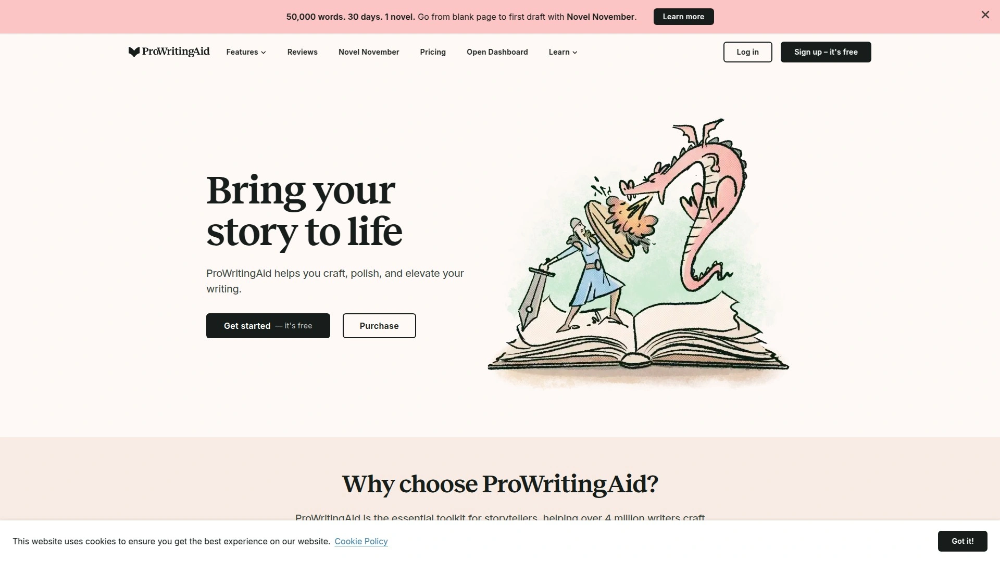

ProWritingAid targets authors and long-form writers requiring thorough editing. The platform generates extensive reports analyzing everything from pacing and sentence variety to overused words and clichés. For academic writers, the style report identifies passive voice, vague language, and complex sentence structures that reduce readability.

The grammar checker covers basic to advanced errors while the thesaurus suggests alternatives for repetitive vocabulary. The plagiarism detector compares text against published content, crucial for thesis submissions and journal articles. Genre-specific recommendations help tailor writing for specific academic fields or publication types.

Integrations work with Scrivener, Microsoft Word, Google Docs, and major browsers. The Rephrase tool offers sentence-level rewriting options, while AI Sparks helps continue or enhance sections where you're stuck. Desktop apps for Windows and Mac provide offline editing capabilities.

The free version limits checks to 500 words, making it impractical for academic papers. Premium subscriptions start at $10 monthly when paid annually, offering unlimited word counts and full access to all 25 reports. The lifetime plan at $399 appeals to students and researchers who write extensively throughout their careers.

---

## **[LanguageTool](https://languagetool.org)**

Open-source multilingual grammar checker supporting 30+ languages with robust free features.

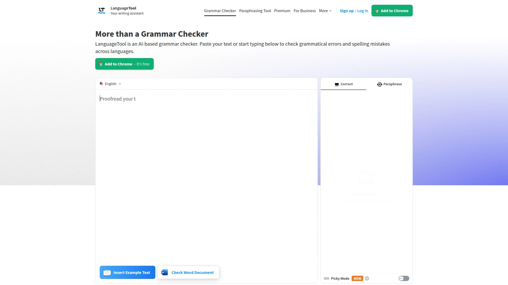

LanguageTool serves bilingual writers and international research teams. Its multilingual capabilities check grammar, spelling, and style across English, Spanish, French, German, Portuguese, and many other languages. The open-source foundation allows developers to integrate it into custom workflows through APIs and plugins.

The Picky Mode, available in premium tiers, provides enhanced grammar and style recommendations beyond basic checks. It flags passive voice, unclear phrasing, and punctuation errors with greater sensitivity. Users create personalized dictionaries for technical terms and specialized vocabulary common in their research fields.

Browser extensions integrate with Chrome, Firefox, Safari, and Edge. Add-ons work with Google Docs, Microsoft Word, LibreOffice, and OpenOffice. The web editor supports documents up to 10,000 characters on the free plan, expanding to 150,000 for premium users. Paid plans also include unlimited paraphrasing and advanced punctuation checking.

The free version provides substantial functionality for students and occasional writers. Premium subscriptions cost less than competitors while offering multilingual support rarely found elsewhere. For researchers collaborating internationally or publishing in multiple languages, LanguageTool delivers unmatched versatility.

---

## **[Scribbr Grammar Checker](https://www.scribbr.com)**

Academic-oriented grammar checker powered by QuillBot technology with emphasis on student needs.

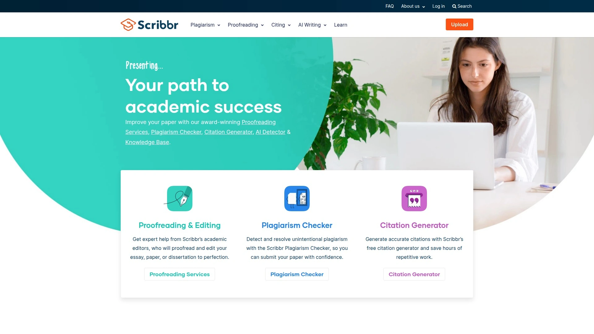

Scribbr focuses exclusively on academic writing, making it ideal for essays, theses, and dissertations. The grammar checker identifies errors with impressive accuracy, correcting 18 out of 20 test errors in comparative studies—significantly outperforming many premium alternatives. No sign-up required, allowing immediate use without account creation.

The tool provides simultaneous error correction, enabling one-click fixes for multiple mistakes. Explanations accompany suggestions, helping students learn grammar rules while editing. The interface remains uncluttered, focusing on essential corrections without overwhelming users with excessive features.

Scribbr operates completely free for grammar checking. Users interested in additional features like advanced paraphrasing or plagiarism detection can subscribe to QuillBot Premium at $9.95 monthly, though basic Scribbr functionality remains unchanged. The straightforward approach appeals to students who need reliable grammar correction without complex feature sets.

Integration remains web-based, requiring copy-paste for checking. While less convenient than browser extensions, the simplicity ensures quick access for students working on assignments. The focus on educational use cases makes Scribbr particularly valuable for undergraduate and graduate students building their academic writing skills.

---

## **[Ginger Software](https://www.gingersoftware.com)**

AI-powered grammar checker with translation capabilities across 40+ languages and text-to-speech features.

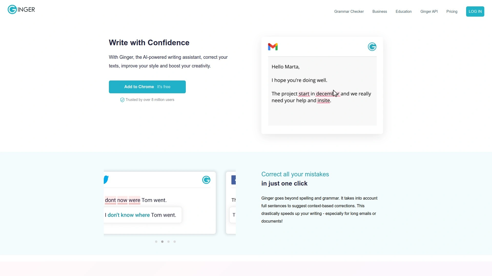

Ginger serves non-native English speakers with its translation tools and language learning features. The grammar checker identifies contextual errors based on sentence meaning rather than just isolated word analysis. The Sentence Rephraser suggests alternative phrasings, useful when explaining complex academic concepts in clearer terms.

The Text Reader speaks your writing aloud, helping catch awkward phrasing or flow issues that appear correct on screen. This auditory proofreading method proves particularly effective for detecting rhythm problems in academic arguments. The Personal Trainer tracks common mistakes and provides customized lessons to prevent repeated errors.

Mobile keyboard integration allows error-free typing on smartphones and tablets, essential for researchers who draft content on multiple devices. Browser extensions and desktop applications work across major platforms. The translation feature helps international students and researchers working with multilingual sources.

Free users access basic grammar and spell checking. Premium plans cost $13.99 monthly or $79.99 annually, with a Ginger Page plan at $8.99 monthly for extended document checking. While interface polish lags behind newer competitors, Ginger's multilingual support and learning tools provide genuine value for diverse user needs.

---

## **[Hemingway Editor](https://hemingwayapp.com)**

Readability-focused writing tool that simplifies complex prose and eliminates unnecessary words.

Hemingway approaches editing differently—it prioritizes clarity over grammatical perfection. The tool highlights lengthy, hard-to-read sentences in yellow and very dense sentences in red. It flags passive voice, suggests active alternatives, and identifies adverbs that weaken statements. For academic writers, this helps transform convoluted theoretical discussions into accessible prose.

The readability score provides immediate feedback on comprehension difficulty. Academic writing often requires technical language, but Hemingway ensures your ideas remain understandable to target audiences. Color-coded feedback makes issues visually obvious, allowing quick identification of problem areas.

The free web version provides core functionality without restrictions. The Plus desktop version adds AI-powered editing for $25 monthly on the 5K plan or $30 monthly for 10K words. The AI features help rewrite unclear passages and generate alternative phrasings while maintaining your intended meaning.

Unlike comprehensive grammar checkers, Hemingway focuses narrowly on readability. It complements rather than replaces traditional grammar tools. Academics benefit from using Hemingway after completing grammar checks to ensure their research findings communicate effectively to readers beyond narrow specialist audiences.

---

## **[Wordtune](https://www.wordtune.com)**

AI rewriting assistant that offers multiple phrasing alternatives with tone adjustment capabilities.

Wordtune excels at sentence-level improvements. Rather than just flagging errors, it presents several alternative phrasings for any selected sentence, allowing writers to choose options that best match their voice and intent. For academic writing, this helps refine arguments, clarify complex explanations, and adjust formality levels.

The tone selector switches between formal and casual styles, useful when adapting research for different audiences—from peer-reviewed journals to conference presentations or public outreach materials. The expand and shorten features help meet word count requirements while preserving meaning.

Wordtune integrates with browsers, Google Docs, and email platforms. The AI understands context, ensuring suggestions maintain logical flow within larger paragraphs. For non-native speakers, Wordtune provides natural-sounding alternatives that might not occur to them, effectively functioning as a fluency coach.

The free plan offers basic rewriting with daily limits. Premium subscriptions unlock unlimited rewrites, additional tone options, and the Spices feature for creative variations. While not a comprehensive grammar checker, Wordtune pairs effectively with other tools to elevate overall writing quality.

---

## **[WhiteSmoke](https://www.whitesmoke.com)**

Comprehensive writing assistant with grammar checking, translation, and plagiarism detection.

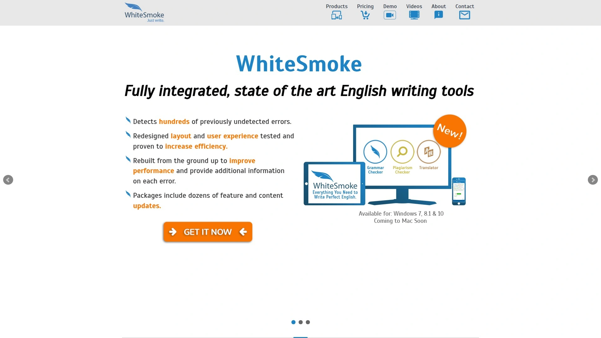

WhiteSmoke combines essential writing tools in one platform. The grammar checker identifies spelling, punctuation, and style errors across complex sentence structures. Style suggestions improve clarity and professionalism, helping academic writers maintain scholarly tone throughout manuscripts.

The translator handles over 55 languages, supporting international research collaboration and multilingual literature reviews. Video tutorials explain grammar rules, making WhiteSmoke educational as well as corrective. The plagiarism checker compares work against online content to ensure originality.

Templates for research proposals, grant applications, and academic correspondence accelerate document creation. Integration with Microsoft Word, Outlook, and browsers enables real-time checking across writing environments. Mobile access ensures consistent writing quality on smartphones.

Pricing remains competitive with web plans at $5 monthly, premium at $6.66 monthly, and business at $11.50 monthly when paid annually. The interface appears dated compared to modern alternatives, but functionality remains solid. For budget-conscious students needing multiple tools, WhiteSmoke delivers comprehensive features at reasonable cost.

---

## **[Sapling](https://sapling.ai)**

AI-powered autocomplete and grammar checker designed for professional communication and customer support.

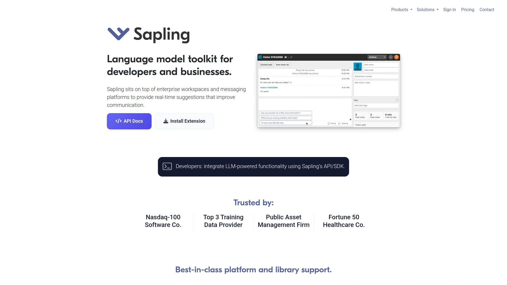

Sapling targets business writing but adapts well to academic contexts requiring clear, professional communication. The AI-powered autocomplete speeds up document creation by predicting likely phrases based on context. For researchers writing frequent emails, grant applications, or reports, this automation significantly reduces composition time.

Real-time grammar and style corrections ensure professional polish across messages. The personal snippet storage saves frequently used responses, useful for standard email replies or common explanations. Team analytics track communication efficiency, though individual academics primarily benefit from writing acceleration features.

Integration works with customer support platforms like Zendesk and Freshdesk, plus general tools including Gmail and Google Docs. The Chrome extension provides wide compatibility across web-based applications.

Free plans offer basic grammar checking. Paid subscriptions add advanced features suitable for research teams managing high-volume communications. While not designed specifically for academic writing, Sapling's focus on clarity and speed benefits researchers handling administrative correspondence alongside scholarly work.

---

## **[Linguix](https://linguix.com)**

AI writing assistant offering grammar checking, style suggestions, and content quality scoring.

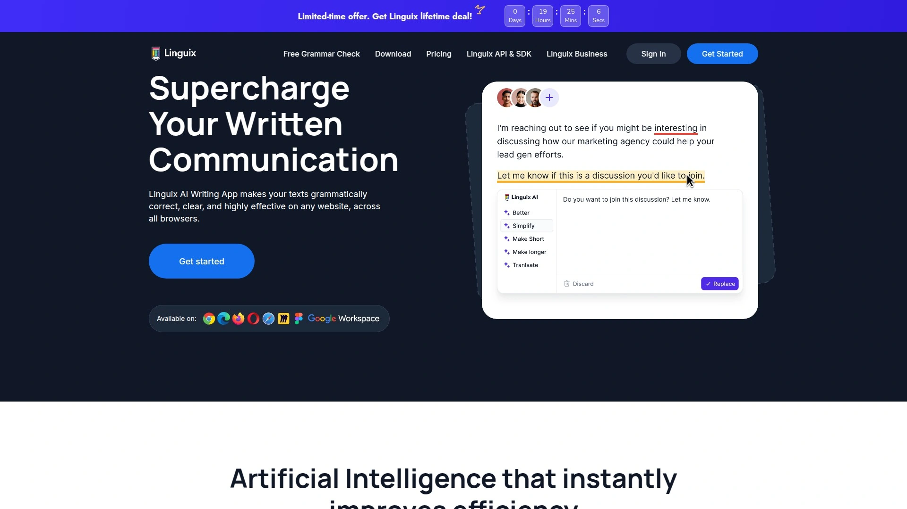

Linguix provides context-based corrections using over 2,000 rules and 17,700 patterns. The AI learns user writing tendencies, offering increasingly personalized recommendations over time. Style suggestions enhance vocabulary and sentence structure beyond basic error correction.

The content quality score provides instant feedback on overall writing effectiveness. Templates for emails, blog posts, and documents accelerate common writing tasks. For academic writers, these templates can serve as starting points for proposals, abstracts, or correspondence.

Browser extensions, mobile apps, and integrations with Google Docs and Word ensure accessibility across platforms. The personal dictionary accommodates technical terminology and specialized vocabulary. Team features allow collaborative editing and shared style guides for research groups.

Free users access basic grammar and spell checking. Premium plans at $18.95 monthly unlock advanced checks, unlimited rewrites, and personalized learning materials. The lifetime plan at $108 offers significant savings for long-term users.

---

## **[Writer.com](https://writer.com)**

Enterprise-focused AI writing platform with custom style guide creation and team collaboration.

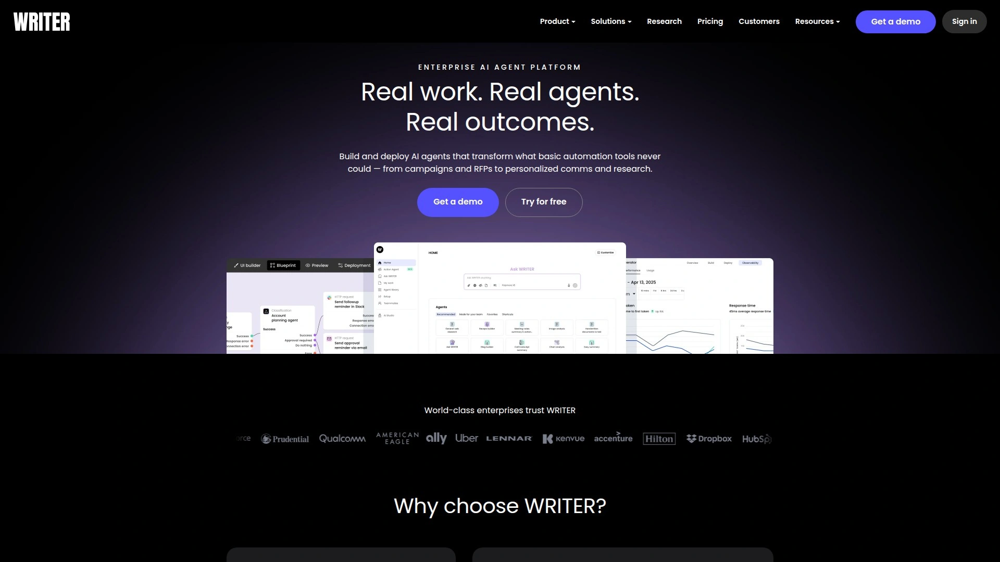

Writer.com serves organizations requiring consistent writing standards across team members. Users create custom style guides defining preferred terminology, forbidden phrases, and brand voice. For research institutions, this ensures uniform writing quality across publications and grant applications.

The grammar checker provides brand-specific feedback, maintaining consistency beyond general correctness. Vocabulary suggestions keep content engaging while adhering to established conventions. Integration with Chrome, Word, and Google Docs enables seamless workflow incorporation.

Clarity checks ensure accessibility, while plagiarism detection protects originality. Teams convert content to gender-neutral language automatically. The platform works best for research groups, departments, or institutions rather than individual academics.

Pricing targets business and enterprise customers with team-focused plans. Individual subscriptions start at $11 monthly, though Writer.com emphasizes organizational use cases. Academic teams benefit most from coordinated writing standards and collaborative features.

---

## **[Scribens](https://www.scribens.com)**

Free grammar checker with extensive error detection and bilingual support for English and French.

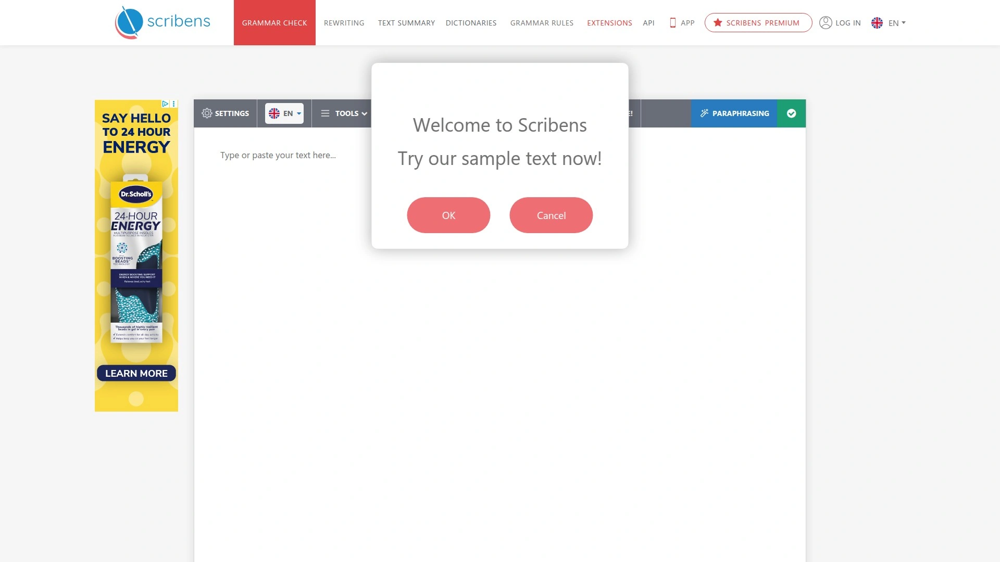

Scribens corrects over 250 types of grammatical and spelling errors, significantly more than Microsoft Word's built-in checker. The platform identifies sentence fragments, run-ons, and style inconsistencies. Dictionary integration provides immediate word definitions and usage examples.

Statistical analysis shows writing metrics including word count, sentence complexity, and readability scores. Style suggestions improve presentation through synonym recommendations and redundancy elimination. Scribens detects whether language is formal, colloquial, or contains slang, helping writers adjust tone appropriately.

Browser extensions work across platforms, integrating with email and office suites. The free web version imposes no word limits or usage restrictions, making Scribens exceptionally accessible for students. Citation support includes APA and Chicago styles, useful for academic papers.

Premium subscriptions at $13.79 monthly add advanced features, though the free version provides substantial functionality. For students seeking comprehensive grammar checking without cost, Scribens delivers impressive capability. Bilingual support makes it valuable for French-English academic writing.

---

## **[PaperRater](https://www.paperrater.com)**

AI-driven proofreading tool with automated essay scoring and grammar analysis for students.

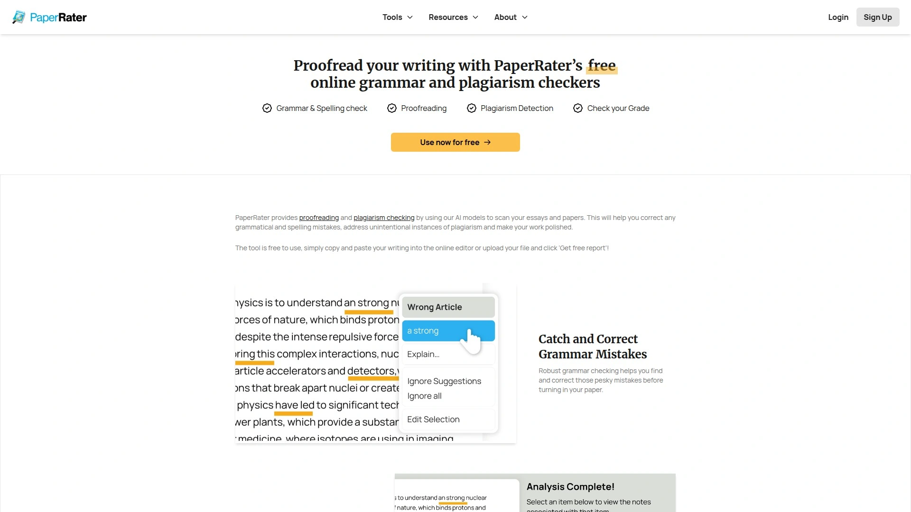

PaperRater targets educational use cases, helping students assess work before submission. The automated scoring system evaluates essays based on grammar, spelling, style, and originality. Students receive grades indicating improvement areas, useful for self-assessment before submitting to instructors.

Comparative analysis measures writing against peers at similar education levels, providing context for performance evaluation. The plagiarism checker scans major search engines, though accuracy trails specialized plagiarism detection services. Grammar suggestions include explanations to promote learning.

Processing completes within 5-15 seconds with no signup required. Simply paste text or upload documents for immediate analysis. The vocabulary builder introduces new words appropriate for academic writing, particularly helpful for expanding expression.

Free access covers core features with usage limits. Premium subscriptions remove restrictions and add advanced analysis. The student-focused design makes PaperRater particularly suitable for undergraduate and high school students developing writing skills. Graduate researchers and professional academics typically require more sophisticated tools.

---

## **[Slick Write](https://www.slickwrite.com)**

Free online grammar checker with detailed statistics and vocabulary analysis tools.

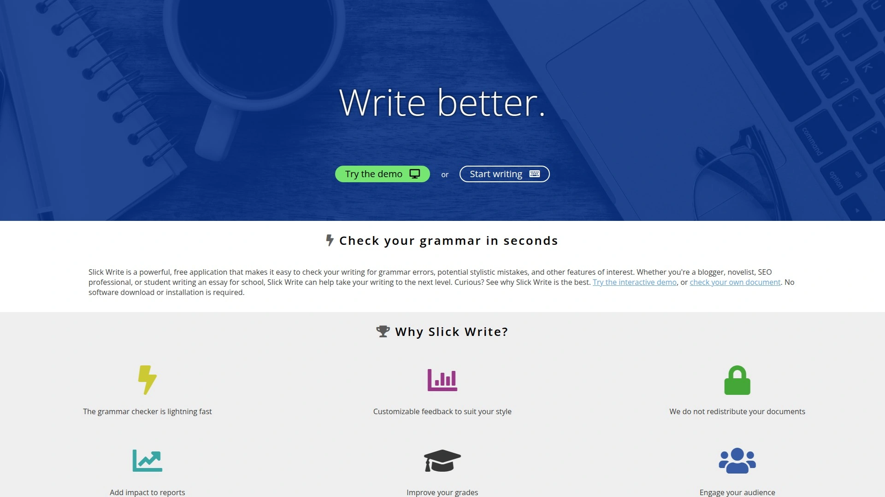

Slick Write provides advanced analysis without cost. The tool checks grammar, spelling, and style while generating comprehensive statistics on sentence length, paragraph structure, word choice, and readability. For academic writers, these metrics help identify patterns affecting prose quality.

The vocabulary analysis highlights repetitive words and suggests alternatives. The Associator tool helps overcome writer's block by displaying related words and concepts. Flow analysis examines sentence rhythm and variety, essential for maintaining reader engagement in lengthy academic papers.

Customizable feedback allows writers to adjust which issues receive highlighting based on their priorities. The critique tab explains flagged problems with detailed information, helping writers learn rather than just fix errors. Chrome and Firefox extensions enable convenient access.

Slick Write remains entirely free with no premium tiers. The 30,000-word submission limit accommodates most academic documents. While lacking spell checking and some polish found in paid tools, Slick Write delivers substantial value for writers seeking detailed analytical feedback at no cost.

---

## **[Reverso](https://www.reverso.net)**

Multilingual grammar checker and translation platform supporting 14 languages with contextual examples.

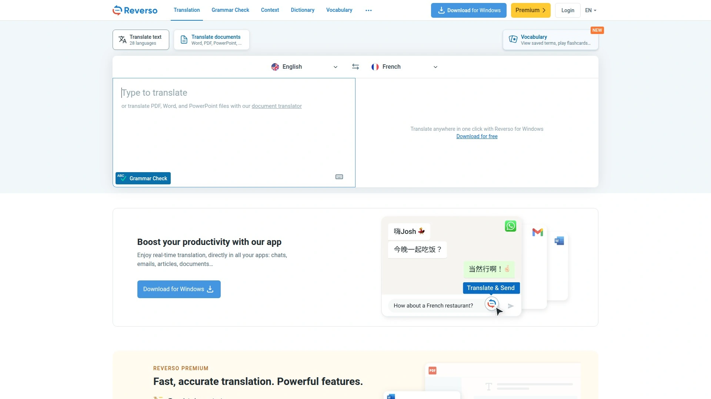

Reverso combines grammar checking with translation capabilities. The platform provides exact translations using advanced technology, displaying usage examples from real contexts. For academics working with international sources or publishing in multiple languages, this contextual approach ensures accurate understanding.

Instant translations with pronunciation guides help non-native speakers improve language skills. The tool works offline, useful for researchers without consistent internet access. Reverse translations and searchable history allow tracking previous lookups.

Real-time suggestions improve writing as you compose. Flashcards support vocabulary retention, beneficial for language learners. The translation tool works on websites and documents through browser extensions.

Free plans allow up to 2,500 words. The focus on translation makes Reverso particularly valuable for multilingual research contexts rather than pure English grammar checking. International students and researchers conducting cross-language literature reviews find exceptional utility in Reverso's combined capabilities.

---

## **[Readable](https://readable.com)**

Readability assessment tool focused on clarity scoring and audience appropriateness analysis.

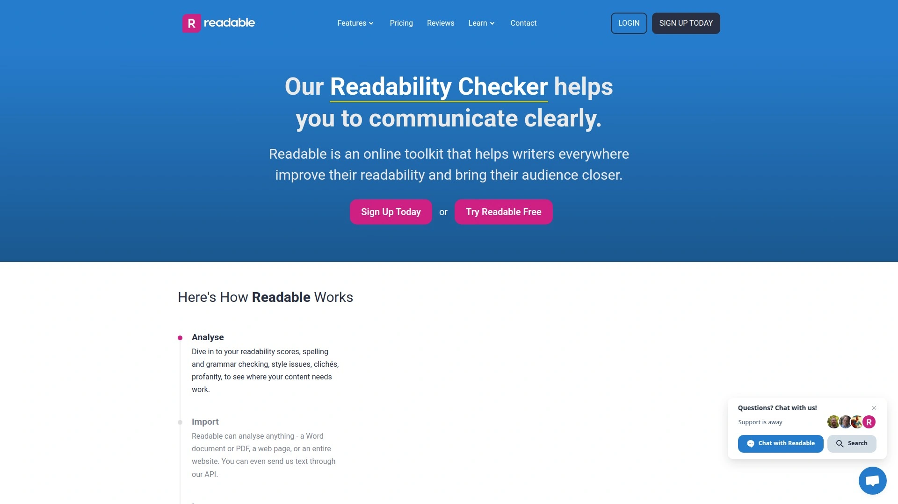

Readable specializes in measuring comprehension difficulty through various readability formulas. The tool calculates Flesch-Kincaid Grade Level, Gunning Fog Index, and SMOG Index scores, indicating education level required to understand your writing. For academic writers, this helps balance technical precision with accessibility.

Sentence length analysis identifies overly complex structures that might confuse readers. Word difficulty scoring highlights jargon and technical terms, useful when determining whether simplification improves clarity without sacrificing accuracy. The tool helps researchers adapt content for different audiences—from specialist journals to public-facing summaries.

Detailed reports break down text by paragraph, sentence, and word complexity. Writers see exactly which sections present comprehension challenges. This targeted feedback enables strategic revision focusing on problem areas rather than rewriting entire documents.

Pricing varies by usage volume, targeting professional writers and content teams. While not a traditional grammar checker, Readable complements error-correction tools by ensuring academic writing remains accessible to intended readers. Researchers writing for interdisciplinary audiences particularly benefit from readability analysis.

---

## **FAQ: Academic Writing & Grammar Tools**

**Which grammar checker works best for scientific papers and technical writing?**

Trinka and Paperpal specialize in academic and technical content. They recognize field-specific terminology, understand complex sentence structures common in research papers, and provide corrections aligned with scholarly publishing standards. Both tools work well across sciences, medicine, engineering, and social sciences.

**Are free grammar checkers sufficient for dissertation and thesis writing?**

Free versions of Scribbr, LanguageTool, and Grammarly cover essential grammar and spelling for shorter sections. However, dissertations benefit from premium features like plagiarism detection, advanced style analysis, and unlimited document length. Consider using free tools for drafts and premium services for final revisions before submission.

**How do I choose between grammar checkers for academic writing versus general writing?**

Academic-focused tools understand formal tone requirements, citation formats, and discipline-specific conventions that general checkers miss. If you primarily write research papers, choose tools like Trinka, Paperpal, or Scribbr. For mixed writing including emails and reports alongside academic work, general tools like Grammarly or QuillBot offer greater versatility.

---

## Conclusion

The right grammar checker transforms your academic writing from merely correct to genuinely compelling. Whether you need Trinka's discipline-specific corrections for medical research, QuillBot's paraphrasing for explaining complex theories, or Hemingway's clarity focus for accessible scholarship, matching tools to your writing context makes the difference.

For researchers and students handling technical manuscripts, [Trinka AI](https://www.trinka.ai) stands out with its training on millions of academic papers and understanding of scholarly conventions. Its comprehensive error detection, field-specific terminology recognition, and journal preparation features specifically address academic writing challenges that general grammar checkers overlook.

Remember that even the best AI tools complement but don't replace human judgment. Use these grammar checkers to catch errors and improve clarity, then apply your expertise to ensure arguments remain sound and ideas flow logically. The combination of AI assistance and human insight produces the strongest academic writing.
